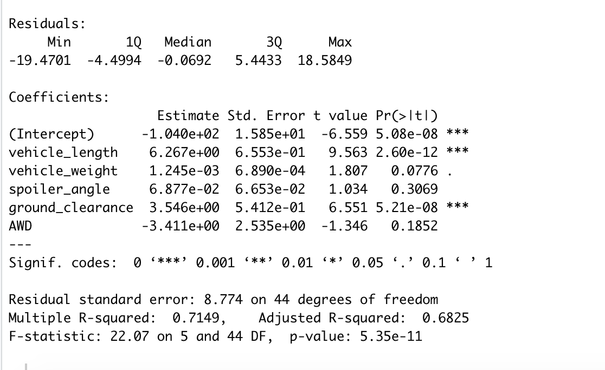
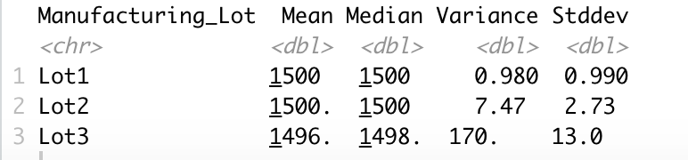

# MechaCar Statistical Analysis

## Linear Regression to Predict Miles Per Gallon (MPG)

Which variables/coefficients provided a non-random amount of variance to the mpg values in the dataset?
- Variables "vehicle_length" and "ground_clearance" provide a non-random amount of variance considering the p values are much lower than the other variables (2.6e^-12 and 5.21e^-8). 

Is the slope of the linear model considered to be zero? Why or why not?
- No it is not considered to be zero. Considering the p-value (5.35e^-11 is way below 0.05, we can reject the null hypothesis. 

Does this linear model predict mpg of MechaCar prototypes effectively? Why or why not?
- the R-Squared value is 0.7149 for this dataset, which means it has an efficacy of prediction of ~71.49%. This implies that the linear model effectively predicts mpg of MechaCar prototypes. 

## Summary Statistics on Suspension Coils

The design specifications for the MechaCar suspension coils dictate that the variance of the suspension coils must not exceed 100 pounds per square inch. Does the current manufacturing data meet this design specification for all manufacturing lots in total and each lot individually? Why or why not?
- Overall in total the variance falls below 100 pounds per square inch as shown in the screenshot above. However Lot3 falls way outside the acceptable range at 170 pounds per square inch. Lot1 and Lot2 fall below the acceptable limit. 

## T-Tests on Suspension Coils
Analyzing the results of the t-test analysis overall and for each individual lot, shows that for the overall analysis, Lot1 and Lot2 we do not reject the null hypothesis since the p-value is not below 0.05. However, for Lot3 we do reject the null hypothesis since the p-value is 0.04168. 

## Study Design: MechaCar vs Competition

### Metrics to Test
I would test the maintenance cost metric. None of the variables so far focus on cost, and I think its an important factor regarding the competition from others. 
### Null Hypothesis 
Null Hypothesis: MechaCar has similar costs to competitors and a similar profitability.
Alternate Hypothesis: MechaCar has very different costs to competitors and differs in profitability.
### Statistical Test to Use
I would do a linear regression on the variables to test this. I would look at the p-value and compare it to the p-value from other companies to see which could be the most profitable. 
### Data Needed
I would need cost and expense data to perform this test. Anything essentially that could also affect profitability would be helpful (inflows and outflows).

